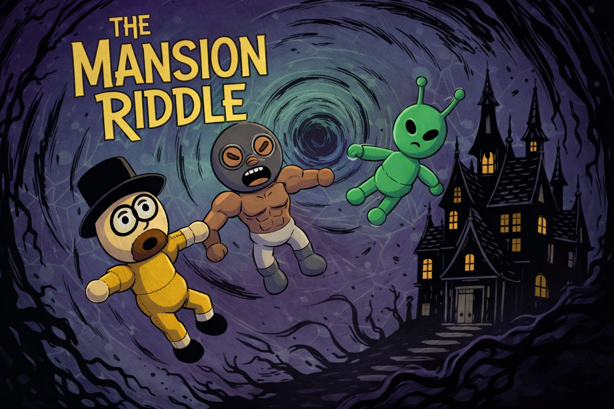
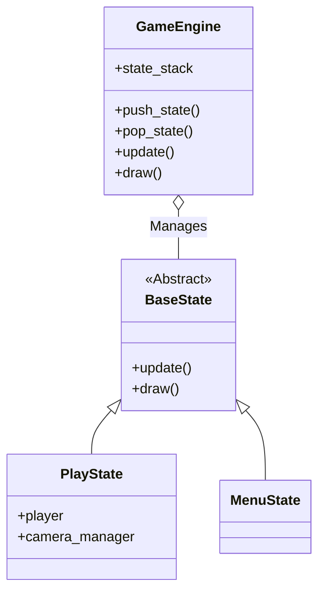

# 🏰 The Mansion Riddle (Project RXJ)



> A retro 3D survival horror engine built from scratch with Python and OpenGL.


## 📖 About the Project

**The Mansion Riddle** is not just a game; it is a deep technical exploration of how classic *survival horror* games (like Resident Evil or Silent Hill) worked. This project implements a custom 3D engine that combines the versatility of **PyGame** for window and input management, with the low-level power of **PyOpenGL** for rendering.

### ✨ Key Features

*   **Native 3D Rendering:** Graphics pipeline implemented manually using OpenGL in Immediate Mode.
*   **Fixed Camera System:** Mathematical implementation of cinematic perspective changes based on invisible *triggers*.
*   **Tank Controls:** Faithful recreation of the classic control scheme that defines the genre.
*   **Scalable Architecture:** Modular design based on State Machines and Design Patterns.

---

## 🛠️ Tech Stack

This project demonstrates proficiency in software engineering and computer graphics:

*   **Language:** Python 3
*   **Core Loop & I/O:** [PyGame](https://www.pygame.org/news) (Window handling, delta time, keyboard/mouse inputs).
*   **3D Graphics:** [PyOpenGL](http://pyopengl.sourceforge.net/) (Primitive rendering, projection and model-view matrix management).
*   **Mathematics:** Extensive use of linear algebra for 3D transformations and camera calculations.

---

## 🏛️ Software Architecture

The code follows **SOLID** principles and design patterns to ensure maintainability:

### Simplified Class Diagram (Mermaid)


### Patterns Used
1.  **State Pattern:** `GameEngine` manages a stack of states (`PlayState`, `MenuState`, `PauseState`), allowing fluid transitions and encapsulated logic.
2.  **Singleton:** Used in `InputManager` and `DataManager` to provide controlled global access to shared resources.
3.  **Observer (Event System):** Decouples game *trigger* logic (like puzzles) from their effects (opening doors), allowing a flexible reactive system.
4.  **Component/Object:** Game entities (`Player`, `Puzzle`) encapsulate their own logic and data.

---

## 🎮 Game Guide

### Controls (Tank Style)
| Key | Action |
| :---: | :--- |
| **W** | Move Forward |
| **S** | Move Backward |
| **A** | Turn Left |
| **D** | Turn Right |
| **E** | Interact (Examine/Open) |
| **ESC** | Pause / Menu |

---

## 🚀 Installation and Execution

Follow these steps to run the project locally.

### Prerequisites
*   Python 3.8 or higher installed.
*   Git to clone the repository.

### Step by Step

1.  **Clone the repository**
    ```bash
    git clone https://github.com/TheJulianAlva/project-rxj.git
    cd project-rxj
    ```

2.  **Create virtual environment (Recommended)**
    ```bash
    python -m venv venv
    # On Windows:
    .\venv\Scripts\activate
    # On Mac/Linux:
    source venv/bin/activate
    ```

3.  **Install dependencies**
    ```bash
    pip install -r requirements.txt
    ```

4.  **Run the game**
    ```bash
    python main.py
    ```

---

## 📂 Project Structure

```
project-rxj/
├── main.py                 # Entry Point
├── engine.py               # Engine Core (State Machines)
├── assets/                 # Resources (Models, Textures, Sounds)
├── data/                   # Configuration and levels (JSON)
├── game_objects/           # Entities (Player, Puzzles, Cameras)
├── state/                  # Game State Logic
├── systems/                # Global Systems (Audio, Input, Triggers)
└── utilities/              # Math tools and helpers
```

---

## 🤝 Contribution

Contributions are welcome under the **Feature Branch** workflow!

1.  Fork the project.
2.  Create a branch for your feature (`git checkout -b feature/AmazingFeature`).
3.  Commit your changes (`git commit -m 'Add: AmazingFeature'`).
4.  Push to the branch (`git push origin feature/AmazingFeature`).
5.  Open a Pull Request.

---

## 👥 Contributors

This project was developed by a team:

*   **[TheJulianAlva](https://github.com/TheJulianAlva)** - *Julián Alva*
*   **[Rogelios100](https://github.com/Rogelios100)** - *Rodrigo Del Ángel*
*   **[Ximenakdsk](https://github.com/Ximenakdsk)** - *Ximena Hernández*

---

## 📄 License

This project is licensed under the **MIT License** - see the `LICENSE` file for details.

---

*Developed as a final project for the Computer Graphics course.*

